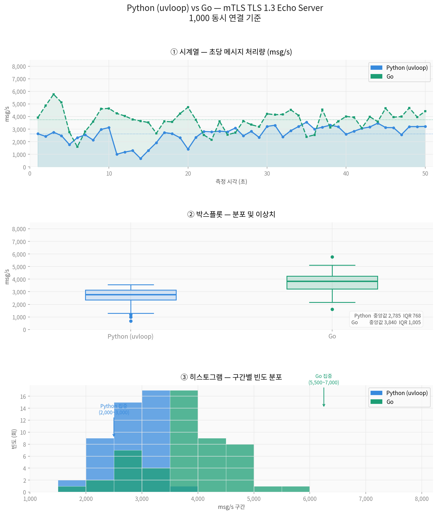

# 성능 비교: Python (uvloop) vs Go (Goroutine)

## 측정 환경&조건

- virtualbox
- 동시 연결: 1,000개(run_all.sh 참조)
- 프로토콜: mTLS TLS 1.3 Echo
- 버퍼 크기: 8,192 bytes

### server
```
OS : Debian
메모리 : 6144 MB
CPU Core : 3 개
cmd/go_svr
cmd/py_svr
```

### client
```
OS : ubuntu
메모리 : 4096 MB
CPU Core : 4 개
cmd/go_client 동일 사용
10개 client
```

## 빌드
### 인증서 생성
```
cd certs
./gen_certs.sh
cd ..
```
### Go
```
go build -o go_svr ./cmd/go_svr
go build -o go_client ./cmd/go_client
```
### python
```
cd cmd/py_svr
python3 -m venv venv
source ./venv/bin/activate
pip install -r requirement.txt
pyinstaller --onefile --name py_svr main.py
cp dist/py_svr ../../.
```

## 성능측정

> cmd/py_svr/analysis.py 사용

> py_svr.log와 go_svr.log 각각 50개 데이타



## 참고
- 암호화 통신에 따른 처리 성능 분석이다.
- print, log 파일 기록과 같은 io 발생이 성능에 영향을 주고 있다.


